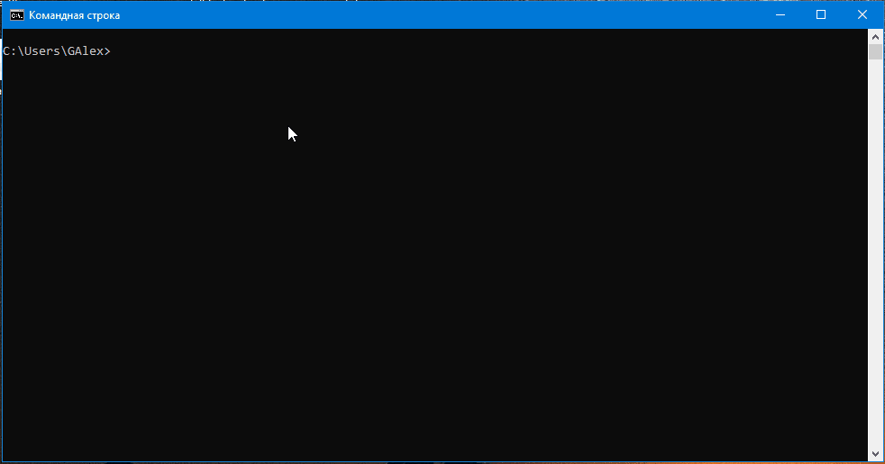

# Модуль 4. Основи Kubernetes, Задача 4

## Вступ: Опис інструментів та їх призначення
Minikube, Kind та K3d — це три популярні інструменти для розгортання локальних Kubernetes кластерів. Вони дозволяють розробникам тестувати та розгортати додатки в Kubernetes без необхідності використовувати хмарні сервіси або складні інфраструктури.  
* **Minikube** — це офіційний інструмент Kubernetes для запуску локального кластеру. Він використовує віртуальні машини або контейнери для створення середовища, максимально наближеного до реального Kubernetes-кластеру.
* **Kind** (Kubernetes in Docker) — інструмент, який дозволяє запускати Kubernetes-кластери всередині Docker-контейнерів. Він часто використовується для тестування Kubernetes та CI/CD процесів.
* **K3d** — це легка версія Kubernetes, яка працює на основі K3s (спрощеного Kubernetes). K3d дозволяє швидко розгортати Kubernetes-кластери всередині Docker-контейнерів.

## Характеристики

| Характеристика | Minikube | Kind | K3d | Podman |
|:-:|:-:|:-:|:-:|:-:|
| Підтримувані ОС | Windows, macOS, Linux | Windows, macOS, Linux | Windows, macOS, Linux | Linux, Windows (через WSL) |
| Архітектура | Віртуальні машини або Docker | Docker | Docker | Daemonless (без фонових процесів) |
| Автоматизація | Підтримує скрипти та конфігурації | Використовується в CI/CD | Використовується в CI/CD | Інтеграція з SystemD, підтримка Kubernetes YAML |
| Додаткові функції | Моніторинг, керування ресурсами | Легке тестування Kubernetes | Швидке розгортання | Підтримка rootless-контейнерів, генерація Kubernetes YAML |
| Тип ліцензії* | Apache License 2.0 | Apache License 2.0 | MIT License | Apache License 2.0  |

*Всі три інструменти є відкритими та можуть вільно використовуватися для розробки та тестування Kubernetes-кластерів.  
## Переваги та недоліки
| Інструмент | Переваги | Недоліки |
|:-:|:-:|:-:|
| Minikube | Повна підтримка Kubernetes, багато додаткових функцій | Важкий для ресурсів, повільний старт |
| Kind | Легкий, швидкий, добре інтегрується з CI/CD | Обмежена підтримка додаткових функцій |
| K3d | Дуже швидке розгортання, мінімальне споживання ресурсів | Менше можливостей порівняно з Minikube |
| Podman | Відсутність фонових процесів (daemonless), підвищена безпека, rootless-контейнери | Відносно новий інструмент, менша екосистема порівняно з Docker |

## Демонстрація
### Розгортання «Hello World» на Minikube
1. Створення деплойменту «Hello World»
    ```
    kubectl create deployment hello-world --image=nginx
    kubectl get deployments
    ```
2. Створюємо новий сервіс та робимо його доступним для зовнішніх користувачів
    ```
    kubectl expose deployment hello-world --type=NodePort --port=80
    kubectl get services
    ```
3. Запускаємо сервісний тунель
    ```
    minikube service hello-world
    ```
    або
    ```
    minikube service hello-world --url
    ```
4.	Доступ до застосунку:
    ```
    http://<Minikube_IP>:<NodePort>
    ```
5. Корисні речі:  
    5.1. Завершення роботи
    ```bash
    minikube stop
    ```
    5.2. Повне видалення
    ```bash
    minikube delete
    ```


Вигляд у браузері


## Висновки
* **Minikube** підходить для детального тестування та розробки з повною підтримкою Kubernetes.
* **Kind** ідеальний для CI/CD та швидкого тестування.
* **K3d** — найкращий вибір для швидкого розгортання та легких тестів.
* **Podman** – найкращий вибір для безпечного управління контейнерами, оскільки підтримує rootless-контейнери та не потребує фонових процесів (daemonless). Відмінно підходить для середовищ, де важлива безпека та контроль доступу.

Для локальної розробки в середовищі Kubernetes найкращим вибором буде Minikube:
* **Повна підтримка Kubernetes** – Minikube максимально наближений до реального кластеру Kubernetes, що дозволяє тестувати всі можливості платформи.
* **Гнучкість у налаштуванні** – він підтримує різні драйвери віртуалізації (Docker, VirtualBox, Hyper-V), що дає змогу використовувати його на будь-якій ОС.
* **Додаткові функції** – вбудовані можливості моніторингу, управління ресурсами та підтримка різних плагінів.
* **Зручність для розробників** – дозволяє тестувати масштабування, роботу з мережевими політиками та конфігураціями, що важливо для підготовки продукту до продакшену.

## Джерела
https://oilbeater.com/en/2024/02/22/minikube-vs-kind-vs-k3d/
https://thechief.io/c/editorial/k3d-vs-k3s-vs-kind-vs-microk8s-vs-minikube/
https://www.blueshoe.io/blog/minikube-vs-k3d-vs-kind-vs-getdeck-beiboot/  
Wikipedia
