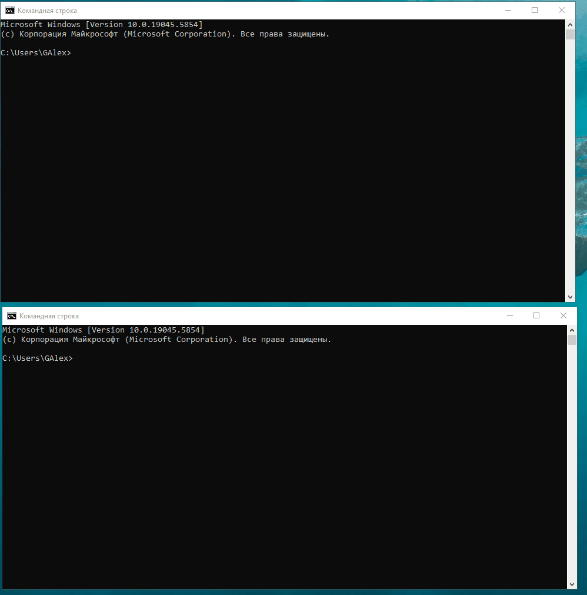

# Модуль 4. Основи Kubernetes, Задача "Налаштування синхронизації Argo CD"

## 1. Налаштування синхронизації

### Демонстрація налаштування синхронизації в Argo CD


***Зауваження.*** В процесі деплою може виникнути помилка:

```text
1:C 26 May 2025 12:46:16.124 * oO0OoO0OoO0Oo Redis is starting oO0OoO0OoO0Oo
1:C 26 May 2025 12:46:16.124 * Redis version=7.4.0, bits=64, commit=00000000, modified=1, pid=1, just started
1:C 26 May 2025 12:46:16.124 * Configuration loaded
1:M 26 May 2025 12:46:16.124 * monotonic clock: POSIX clock_gettime
1:M 26 May 2025 12:46:16.198 * Running mode=standalone, port=6379.
1:M 26 May 2025 12:46:16.199 * Server initialized
1:M 26 May 2025 12:46:16.199 # Can't open or create append-only dir appendonlydir: Permission denied
```

Рішення:
1. Швидке.  
	1.0. (Не тестувалось) Додати в розділ redis файлу values.yaml:
	```
	volumePermissions: enabled: true
	```
	1.1. Виконати команду:
    ```sh
    kubectl get pod demo-redis-master-0 -o yaml -n demo | grep runAsUser
    ```  
    Будуть отримані значення runAsUser та fsGroup (наприклад, 1001 та 1001).  
	1.2. На кожній ноді кластеру minikube, підключившись до нього за допомогою ssh, виконати команди від root (значення runAsUser та fsGroup взяти з результатів попередньої команди):
    ```sh
    cd /tmp/hostpath-provisioner/demo
    chown -R 1001:1001 ./redis-data-demo-redis-master-0
    ```
2. Коректне. Використовуючи NFS або Ceph як джерело дискового простору для redis, створити відповідні Storage Classes та Persistent Volumes

### Демонстрація автоматичної синхронизації

В репозиторій внесено та відалено помилковий коміт ТЕСТ


## 2. Демонстрація працездатності застосунку go-demo-app


