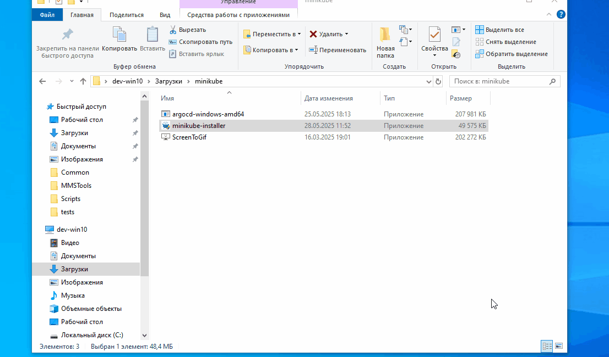
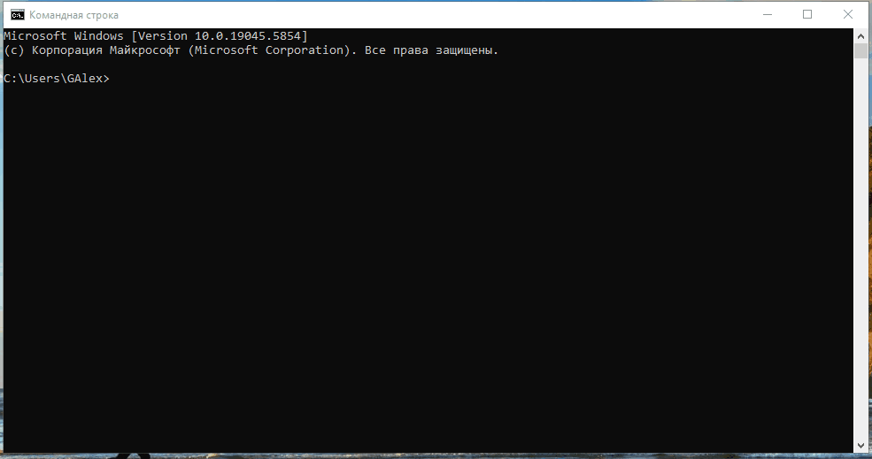

# Модуль 4. Основи Kubernetes, Задача "Розгортання кластеру Minikube та Argo CD"

## 1. Встановлення Minikube

Інструкцію із встановлення можна знайти за посиланням: https://kubernetes.io/uk/docs/tasks/tools/install-minikube/  
Кластер буде розгорнуто на хості з ОС Microsoft® Windows® 10 та використовуючи гіпервізор Oracle® VM VirtualBox®.  
Останній використовує ліцензії: GNU GPL 2 та [пропрієтарну](https://www.virtualbox.org/wiki/VirtualBox_PUEL)  
  
***Зауваження:*** Копіювати з перейменуванням argocd-windows-amd64.exe бажано до папки, яка є в списку шляхів змінной середовища "Path".  
Для демонстрації будо використано шлях до папки із Minikube.  
Процес встановлення інсталятора **minikube-installer.exe**:  


## 2. Розгортагння кластеру Minikube

Перед запуском розгортання кластеру Minikube треба вказати драйвер гіпервізору та параметри для створення віртуальної машини:

```sh
minikube config set driver virtualbox
minikube config set cpus 4
minikube config set memory 16384
minikube config set disk-size 40000MB
```

Разом із командою *minikube start* треба вказати необхідну кількість нод кластеру та найменування профілю, якій стане шаблоном для найменування нод. В нашому випадку:

```sh
minikube start --nodes 3 -p demo-install
```

Оскільки на хості може бути декілька кластерів minikube (як це було зроблено для демонстрації), то для перівіки стану новоствореного кластеру необхідно виконати додаткові команди:  

1. Показати список доступних кластерів Minikube:

    ```sh
    minikube profile list
    ```

2. Переключитись на потрібний кластер Minikube:

    ```sh
    minikube profile demo-install
    ```

3. (Опціонально) повторити п. 1 для перевірки активного кластеру
4. Виконати команду kubectl для перевірки поточного активного контексту:

   ```sh
   kubectl config current-context
   ```

5. За необхідності, переключити kubectl на потрібний контекст (кластер):

    ```sh
    kubectl config use-context demo-install
   ```

Після виконання ціх команд можно перевірити стан кластеру за допомогою minikube  та kubectl:

```sh
minikube status
kubectl get nodes -o wide
```

### Демонстрація розгортання кластеру



## 3. Розгортагння та первинне налаштування Argo CD

0. Рекомендується встановити **Kubernetes Dashboard** та/або **Lens** для контролю та вирішення можливих проблем. Також необхідно завантажити Argo CD CLI **argocd**.
1. Створення namespace та встановлення Argo CD
    ```
    kubectl create namespace argocd
    kubectl apply -n argocd -f https://raw.githubusercontent.com/argoproj/argo-cd/stable/manifests/install.yaml
    ```
2. За необхідності, замеміть тип служби argocd-server на LoadBalancer:
    ```
    kubectl patch svc argocd-server -n argocd -p '{"spec": {"type": "LoadBalancer"}}'
    ```
	Якщо команда поверне помилку, можна використати **Kubernetes Dashboard** або **Lens** для заміни.
    Перевірити заміну можна за допомогою команди:
	```
	kubectl get svc -n argocd
	```

3. Налаштування переадресації портів.
    ```
    kubectl port-forward svc/argocd-server -n argocd 8080:443
    ```
4. Відкрити посилання у браузері:
    ```
	https://127.0.0.1:8080
	```
5. Отримати перший пароль можна за допомогою команди:
    ```
	argocd admin initial-password -n argocd
	```
6. Увійти до інтерфейсу Argo CD та змінити пароль.
7. Видалити секрет argocd-initial-admin-secret командою:
    ```
	kubectl delete secret argocd-initial-admin-secret -n argocd
	```

### Демонстрація розгортання Argo CD


